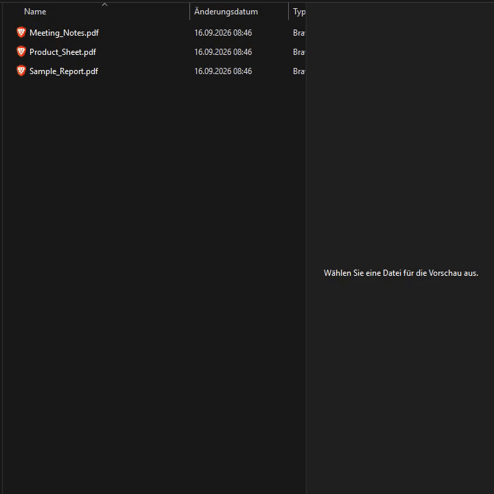

# 🚀 MotW-Preview-Fix - Repair Blocked PDF Previews in Windows Explorer

A lightweight, portable Windows utility that removes the MotW from PDFs in Order to show the preview in Windows Explorer.



----------

## ❗ The Problem

Downloaded PDF files often contain the _Mark of the Web_ (MotW), causing Windows to block the Preview Pane.

Since the October 2025 security updates, Windows disables the preview for anything Internet-zoned. Microsoft flipped `URLACTION_SHELL_PREVIEW` (`0x180F`) in the Internet zone (3) from *Enable* to *Disable* to stop NTLM hash leaks from previewed content referencing external paths.

Two separate things can put a PDF into that zone: the **file** itself (its MotW) and the **location** it sits in (a network share addressed by FQDN or IP). The tool clears the file. The location is a one-time setting (see [Troubleshooting](#-troubleshooting)).

----------

## ✅ The Solution

This tool adds a context menu entry that:

-   Removes the MotW
        
-   Forces Windows Explorer to refresh the preview
    

All **without** renaming the file or timestamp.

----------


## ✨ How to Use

1.  Right-click a PDF file that shows no preview.
    
2.  Select **“Enable Preview”** (or your own text from `config.ini`).
    
3.  The preview appears instantly.
    

----------

## 📦 Installation Options

The tool consists of just two files: `MotW-Preview-Fix.exe` and `config.ini`. It acts as a portable installer/uninstaller.

### **1. Graphical User Interface (GUI)**

Simply double-click `MotW-Preview-Fix.exe`.

-   **Install Current User** – Registers the context menu for the logged-in user (no admin rights required)
    
-   **Install All Users** – Registers system-wide (admin rights required)
    
-   **Uninstall** – Removes all related registry entries
    

### **2. Silent Deployment (CMD / SCCM / Intune)**

Ideal for system administrators.

**Examples:**
```dos
MotW-Preview-Fix.exe /install_global "lang_en" /silent
```

```dos
MotW-Preview-Fix.exe /install_user "lang_de" /silent
```

```dos
MotW-Preview-Fix.exe /uninstall /silent
```

----------

## ⚙️ Parameter Reference

| Parameter              | Description                               | Admin Required? |
|------------------------|-------------------------------------------|------------------|
| `/install_user "ID"`   | Installs for the current user (HKCU).     | ❌ No            |
| `/install_global "ID"` | Installs system-wide (HKLM/HKCR).         | ✔️ Yes           |
| `/uninstall`           | Removes entries from HKCU and HKCR.       | ✔️ Partially*    |
| `/silent`              | Suppresses all success messages.          | –                |

\* Admin rights are required to fully remove global entries.


----------

## 📝 Configuration: config.ini

All text strings and languages can be freely defined.

```ini
; --- GERMAN CONFIGURATION ---
[lang_de]
Name=German
MenuText=Vorschau aktivieren
MsgSuccess=Erfolgreich installiert.
MsgUninstall=Erfolgreich entfernt.

; --- ENGLISH CONFIGURATION ---
[lang_en]
Name=English
MenuText=Enable Preview
MsgSuccess=Installed successfully.
MsgUninstall=Removed successfully.

; --- EXAMPLE: ADDING FRENCH ---
[lang_fr]
Name=French
MenuText=Activer l'aperçu
MsgSuccess=Installation réussie!
MsgUninstall=Supprimé avec succès.

```

----------

## 🔧 How It Works

When you click the context menu entry:

1.  **MotW Removal** – Removes the NTFS `Zone.Identifier` stream (falling back to `Unblock-File`, plus an archive-attribute toggle to nudge the cache).
    
2.  **Shell Notification** – Sends `SHChangeNotify` to refresh the file preview.
    

Step 2 invalidates the thumbnail cache → Explorer re-renders the preview immediately.

----------

## 🩺 Troubleshooting

### The preview is still blocked after clicking "Enable Preview"

**1. Restart Explorer.** Explorer caches the zone it has already seen for a file. Removing the stream does not clear that cache, and `SHChangeNotify` does not always reach it. Log off or restart `explorer.exe`, then look again.

**2. Check whether the file or the path is the problem:**

```powershell
Get-Item "Z:\path\file.pdf" -Stream *
```

-   `Zone.Identifier` is listed → file-level MotW → this tool handles it.
-   No `Zone.Identifier`, still blocked → the share's zone is the cause → step 3.

**3. Put the share into the Local Intranet zone.** Windows maps a UNC path to the Internet zone when the server is addressed by FQDN (`\\fileserver.company.local`) or by IP, basically anything with dots. A plain NetBIOS name (`\\fileserver`) normally lands in Local Intranet, and mapped drive letters inherit the zone of their underlying UNC path.

Set it once per file server, by Group Policy ("Site to Zone Assignment List") or the equivalent registry values:

```reg
Windows Registry Editor Version 5.00

; One server into the Local Intranet zone (value 1), machine-wide.
[HKEY_LOCAL_MACHINE\SOFTWARE\Policies\Microsoft\Windows\CurrentVersion\Internet Settings\ZoneMap\Domains\company.local\fileserver]
"file"=dword:00000001
```

Or treat **all** UNC paths as Intranet. Broader, and correspondingly less safe:

```reg
[HKEY_LOCAL_MACHINE\SOFTWARE\Policies\Microsoft\Windows\CurrentVersion\Internet Settings\ZoneMap]
"UNCAsIntranet"=dword:00000001
```

Manual equivalent: `inetcpl.cpl` → Security → Local intranet → Sites → Advanced, and uncheck *"Require server verification (https:) for all sites in this zone"*.

Once the share is trusted, **MotW-Preview-Fix works there exactly as it does on a local disk**, because downloaded files on that share still carry their own MotW, and that is what the tool removes.

Notes on the registry route:

-   The **policy** hive (`SOFTWARE\Policies\...`) wins over per-user settings. The non-policy `HKLM\SOFTWARE\Microsoft\...\ZoneMap\Domains` path also works, but is merged with `HKCU` and loses on conflict. `Security_HKLM_only=dword:00000001` under `HKLM\SOFTWARE\Policies\Microsoft\Windows\CurrentVersion\Internet Settings` forces machine settings for *all* zones, which is a blunt instrument.
-   Log off or restart Explorer afterwards.
-   This loosens the preview restriction for every file on that share, so use it for locations you actually trust.

### Nothing happens at all, on any file

Some NAS and Samba shares do not support NTFS Alternate Data Streams. There is then no `Zone.Identifier` to delete, and `FileDelete(...":Zone.Identifier")` plus the attribute toggle silently do nothing. Check with the `Get-Item -Stream *` command above.

### The preview pane stays empty for every PDF, blocked or not

Then the problem is not the MotW but the registered PDF preview handler. Check which one `.pdf` points to:

```powershell
Get-ItemProperty 'Registry::HKEY_CLASSES_ROOT\.pdf\shellex\{8895b1c6-b41f-4c1c-a562-0d564250836f}'
```

A stale Adobe handler is a common culprit. Switching to the built-in previewer for the current user:

```powershell
$k = 'HKCU:\Software\Classes\.pdf\shellex\{8895b1c6-b41f-4c1c-a562-0d564250836f}'
New-Item -Path $k -Force | Out-Null
Set-ItemProperty -Path $k -Name '(default)' -Value '{3A84F9C2-6164-485C-A7D9-4B27F8AC009E}'
```

Restart Explorer afterwards. Remove the key to revert.

----------

## ⚠️ Compilation Note

Windows Explorer is 64-bit → the tool **must be compiled as x64**.

If compiled as x86, registry paths are redirected to `Wow6432Node` and the context menu entry won't appear.

----------
